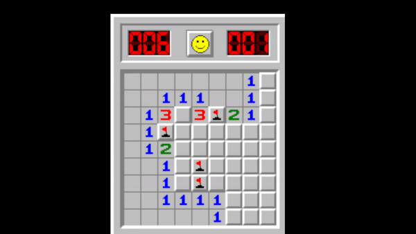

# Simple Minesweeper hack Using Memory editing

Addresses for the hacked values are obtained by using cheat engine.Suprising enough there were no multilevel pointers in the game so no offsets for the addresses.

Game Flag static address = 0x01005194

Game time static address = 0x0100579C

Windows 10 doesn't have the game minesweeper at default so i downloaded it.

Link for the game : http://www.minesweeper.info/downloads/WinmineXP.html

## What it does 

You will have your time stay at 0 and you will have unlimited flags the flag count does not go to 0 or minus.

